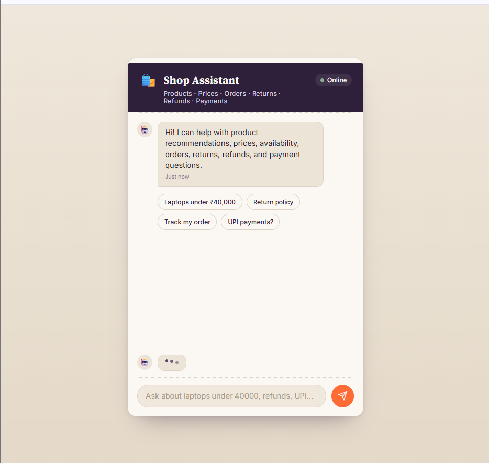
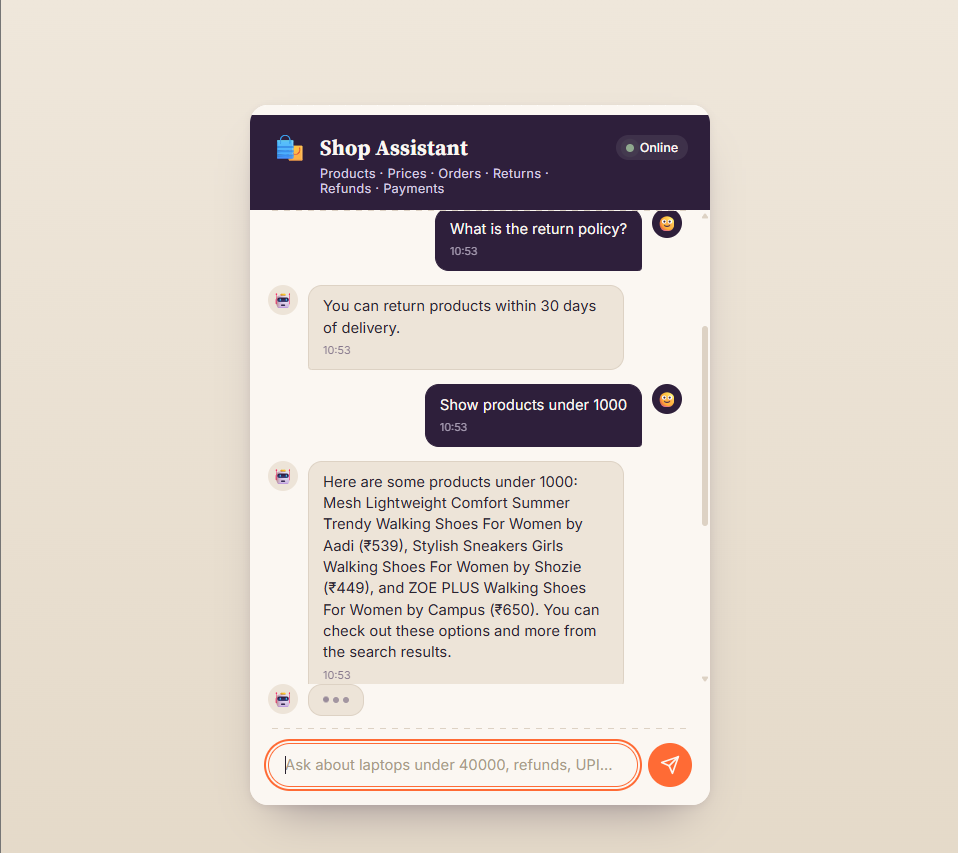
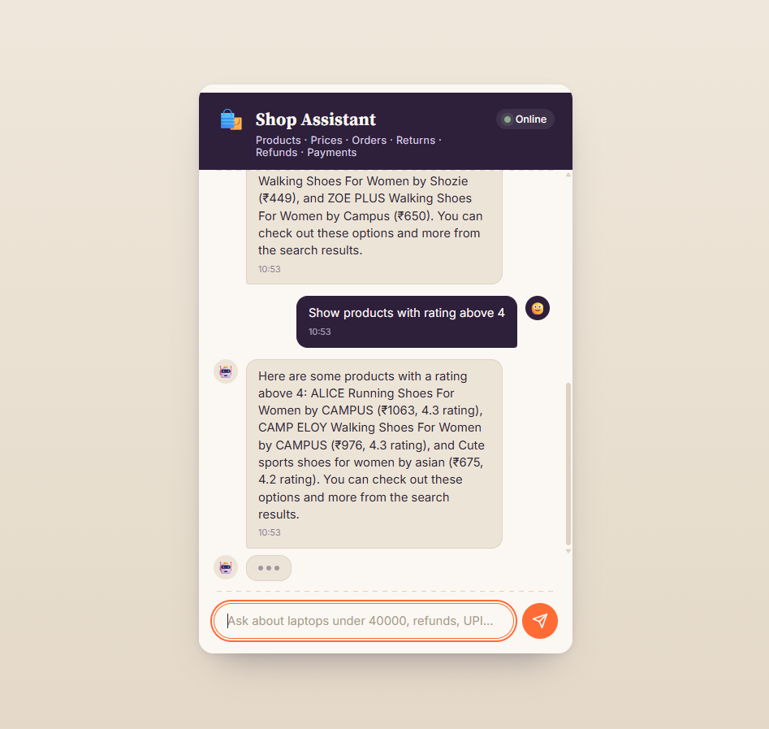

<div align="center">

# 🛒 AI E-Commerce Product & FAQ Assistant

**An AI-powered chatbot that combines Semantic Routing, Vector Search, RAG, and Large Language Models to deliver intelligent product discovery and instant FAQ resolution.**

<br/>


</div>

---

## 📸 Screenshots

<table>
  <tr>
    <td align="center">
      <br/>
      <b>Home Page</b>
    </td>
    <td align="center">
      <br/>
      <b>FAQ & Product Search</b>
    </td>
    <td align="center">
      <br/>
      <b>Rating-Based Query</b>
    </td>
  </tr>
</table>

---

## 🚀 Features

| | Feature | Description |
|---|---|---|
| 📖 | **FAQ Assistant** | Retrieves accurate answers using ChromaDB vector search with context-aware responses via Groq Llama 3.3 |
| 🛍️ | **Product Search** | Filter products by **price**, **rating**, **discount**, and **brand** from a structured SQLite catalog |
| 🧠 | **Intelligent Routing** | Semantic Router auto-classifies user intent and dynamically routes to the right pipeline |
| 💬 | **Chat Interface** | Clean, responsive UI with real-time responses and quick reply suggestions |

---

## 🏗️ Architecture

```
User Query
    │
    ▼
Frontend (HTML / CSS / JS)
    │
    ▼
FastAPI Backend
    │
    ▼
Semantic Router
 ┌──────────────────────┬──────────────────────┐
 │                                             │
 ▼                                             ▼
FAQ Route                               Product Route
 │                                             │
 ▼                                             ▼
ChromaDB                                    SQLite
 │                                             │
 ▼                                             ▼
Groq LLM                                   Groq LLM
 │
 ▼
Response
```

---

## 🛠️ Tech Stack

| Layer | Technologies |
|---|---|
| **Backend** | Python, FastAPI |
| **AI / NLP** | Groq Llama 3.3, Semantic Router, Sentence Transformers (`all-MiniLM-L6-v2`) |
| **Databases** | SQLite, ChromaDB |
| **Frontend** | HTML, CSS, JavaScript |

---

## 💡 Example Queries

<table>
<tr>
<td>

**📖 FAQ Queries**
```
What is the return policy?
How long does a refund take?
What payment methods are accepted?
Can I pay using UPI?
```

</td>
<td>

**🛍️ Product Queries**
```
Show products under ₹1000
Show products with rating above 4
Show discounted products
Show Abros products
```

</td>
</tr>
</table>

---

## ⚙️ Getting Started

**1. Clone the repository**
```bash
git clone https://github.com/sumedhdikshit-blip/E-Commerce-Product-FAQ-Assistant.git
cd E-Commerce-Product-FAQ-Assistant
```

**2. Install dependencies**
```bash
pip install -r requirements.txt
```

**3. Set up environment variables**

Create a `.env` file in the project root:
```env
GROQ_API_KEY=YOUR_API_KEY
GROQ_MODEL=llama-3.3-70b-versatile
```

**4. Start the server**
```bash
uvicorn main:app --reload
```

**5. Open in your browser**
```
http://127.0.0.1:8000
```

---

## 📚 What I Learned

- Building end-to-end **RAG pipelines** with vector databases
- **Semantic search** using ChromaDB and Sentence Transformers
- **Intent classification** and dynamic routing with Semantic Router
- Integrating **LLMs via Groq API** into production-ready backends
- Developing **FastAPI** REST services with a clean frontend

---

## 🔮 Future Enhancements

- [ ] Product Recommendation Engine
- [ ] User Authentication & Chat History
- [ ] Voice Assistant Support
- [ ] Docker & Cloud Deployment
- [ ] Multi-Language Support

---

## 👨‍💻 Author

<div align="center">

**Sumedh Dikshit**

[](https://github.com/sumedhdikshit-blip)

⭐ *Found this useful? Consider starring the repository!*

</div>
